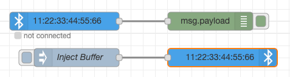

# `bluetooth-serial-port` for Node-RED

This set of nodes enabled Node-RED to send and receive messages over Bluetooth Classic serial.



Can be used to communicate with an arduino or some Divoom boxes for example.

## Usage
```sh
npm install node-red-contrib-bluetooth-serial-port
node-red
```

## Dependencies
Make sure those packages are installed where Node-RED is running.
* libbluetooth-dev
* bluez

## License
Licensed as MIT. All rights not explicitly granted in the MIT license are reserved. See the included [LICENSE](./LICENSE) file for more details.
